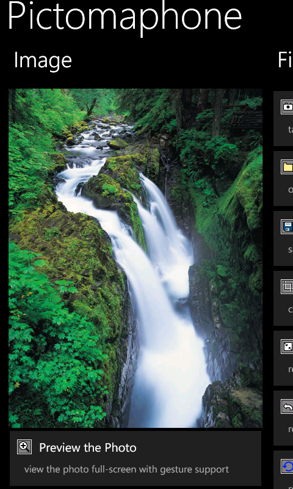
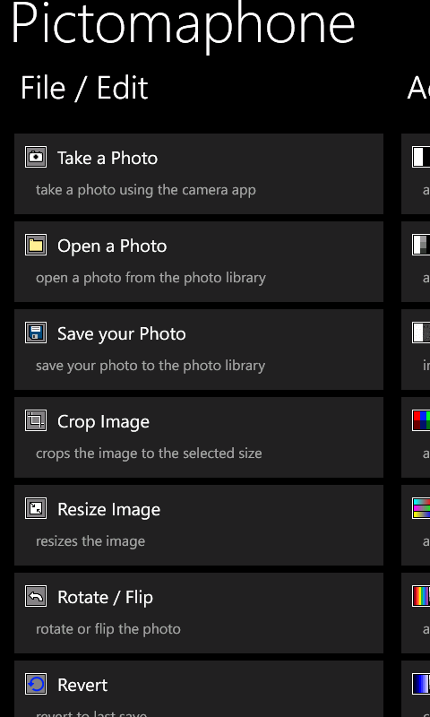
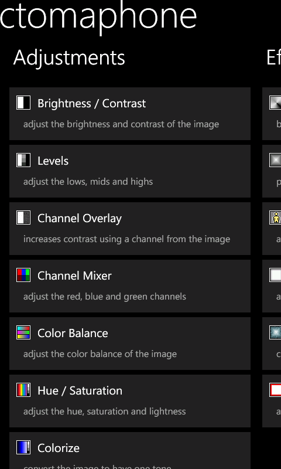
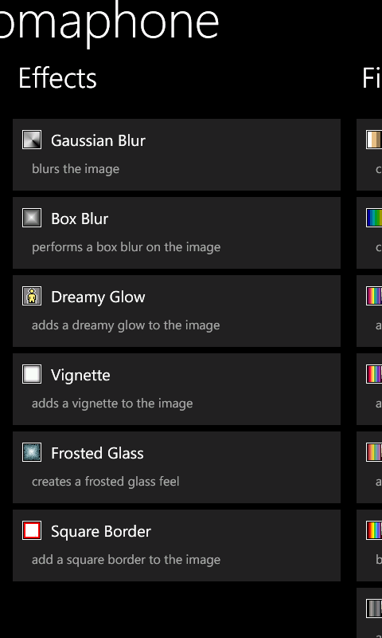
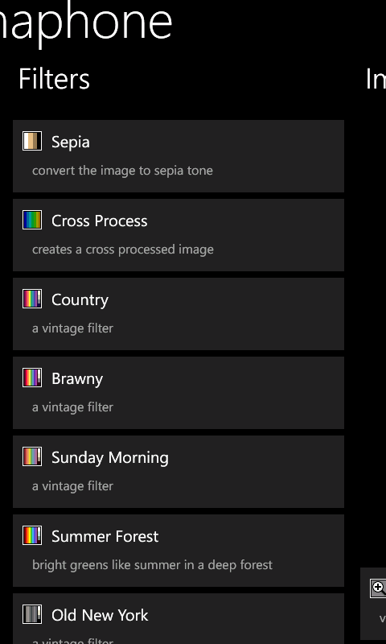
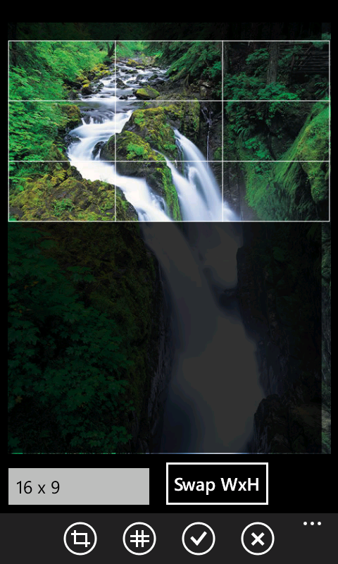
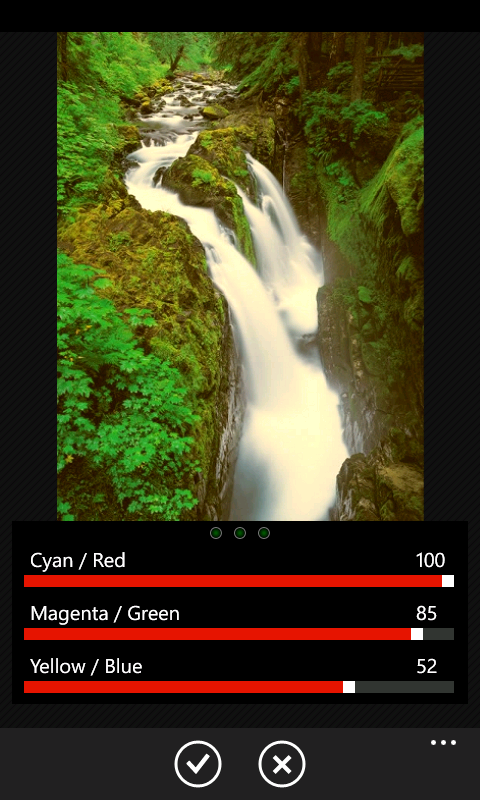
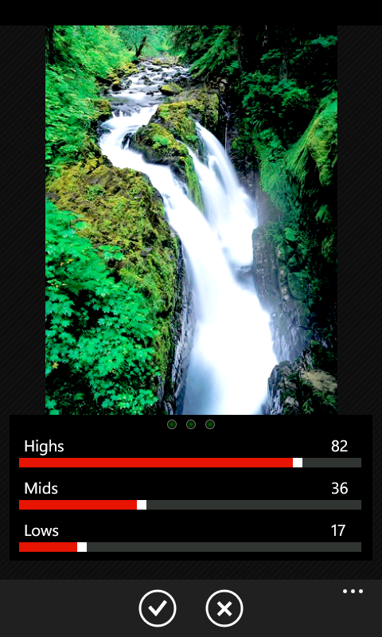
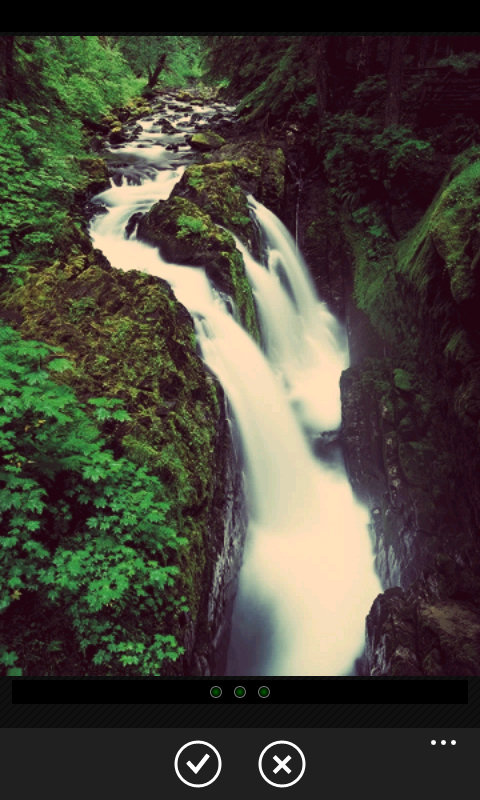
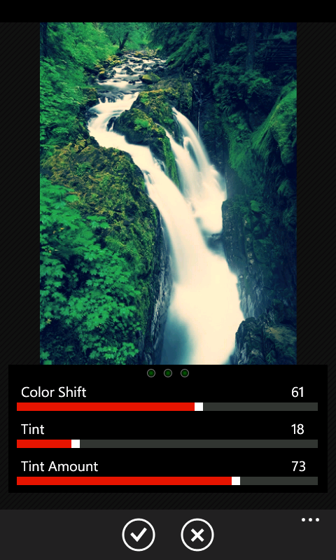

# Pictomaphone
The best photo editing app for Windows Phone 7 - back in 2012. All of the original source code is now available for reference.

Pictomaphone was first released on November 5th, 2011 as a free app on the Windows Phone marketplace where it quickly rose to be one of the top free photo editing applications.

In early 2012 I converted it to a paid app with an unlimited free trial (with nag screen) - and in no time it was the top "paid" photo app in the marketplace with over 100,000 users. 

## Main UX

  
## Background
Windows Phone 7 had some tough limitations that made creating a photo editor difficult. 

- The image size for applications was capped at 3 megapixels, even though the phones took higher resolution images.
- Apps ran on Silverlight, which was not very optimized for ARM chips and had its own limitations
- There wasn't a way to call ARM intrinsics for vectorization of math operations
- There wasn't a way to run custom shaders on the GPU
- You couldn't run unsafe code or use pointers

If I were writing a photo editing app in .NET now, I would have so many more options to optimize the code. However, I was able to get the code to a pretty good performance level for those old phones.

- The UI shows a much smaller image for the preview while making adjustments so that it can update "live" - then when OK is chosen it applies the changes to the full image.
- The divide operation was very slow compared to multiply, so wherever possible multiplication is used.
- Lookup tables are created for some operations where it made sense, like curves, to speed up computation time.
- Unrolling operations wherever possible

## Photo Editing Features
Pictomaphone had a wide variety of photo adjustments, filters, and effects available.
  
### Edit

  
- Crop (image)
- Resize
- Rotate / Flip
- Revert
 
### Adjustments

  
- Brightness and Contrast
- RGB Channel mixer
- Channel overlay
- Color Balance (image 1)
- Color Overlay
- Colorize
- Curves
- Grayscale
- Hue, Saturation, and Lightness
- Levels (image 2)
- Negative
- Posterize
- Sepia
- Solarize
- Temperature and Tone (using LAB colorspace)
- Vibrance (using LAB colorspace)
  
## Effects
- BoxBlur
- Dreamy Glow (a stack blur applied based on brightness)
- Frosted Glass
- Gaussian Blur
- Red Eye fix
- Stack Blur
- Tilt Shift
- Vignette

## Filters
Some of the filters are sort-of based on Instagram filters, and others were just ones I liked.

  
- Brawny (image 1)
- Country
- Cross Process (image 2)
- Lomo
- Old New York
- Summer Forest
- Sunday Morning
- Velvian

## Borders
- Square Border
